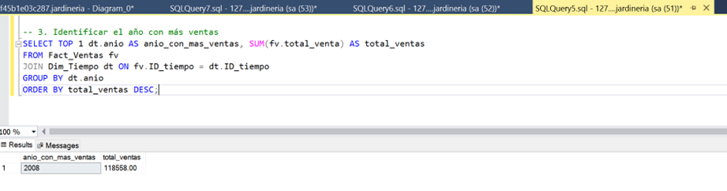

[Atrás](../readme.md)

# S20 - Evidencia de aprendizaje 1. Modelo estrella de un Data Mart

## Introducción

Este documento presenta el diseño de un modelo estrella para un data mart basado en la base de datos Jardinería. El modelo permitirá analizar y responder a tres categorías específicas: identificar el producto más vendido, la categoría con más productos y el año con más ventas.

## Objetivos

1. Diseñar un modelo estrella eficiente para el análisis de ventas.
2. Facilitar la identificación del producto más vendido.
3. La categoría con más productos.
4. El año con más ventas.

## Planteamiento del problema

La empresa de jardinería necesita un sistema de análisis que permita tomar decisiones basadas en datos sobre sus ventas, productos y categorías. El modelo actual de base de datos transaccional no es óptimo para este tipo de análisis.

## Análisis del problema

La base de datos actual contiene información detallada sobre productos, categorías, clientes, pedidos y pagos. Sin embargo, para realizar análisis eficientes, es necesario transformar esta estructura en un modelo dimensional que facilite las consultas analíticas.

## Propuesta de la solución

1. Descripción del modelo estrella propuesto

    El modelo estrella propuesto consta de una tabla de hechos central (Ventas) rodeada por cuatro dimensiones clave: Producto, Categoría, Cliente y Tiempo. Este diseño permitirá un análisis rápido y eficiente de las ventas desde múltiples perspectivas.

## Diseño del modelo estrella

1. Dim_Producto
2. Dim_Categoria
3. Dim_Cliente
4. Dim_Tiempo

## Especificación de dimensiones

## Tabla de hechos

### Facilitar la identificación del producto más vendido.

### Identificar la categoría con más productos

### Identificar el año con más ventas

## Conclusiones

El modelo estrella propuesto permitirá a la empresa de jardinería realizar análisis eficientes de sus ventas, productos y categorías. Este diseño facilitará la identificación del producto más vendido, la categoría con más productos y el año con más ventas, cumpliendo así con los objetivos planteados.

## backups

1. Archivo de backup de la base de datos Jardinería: Jardineria_Backup.bak

## Bibliografía

Kimball, R., & Ross, M. (2013). The Data Warehouse Toolkit: The Definitive Guide to Dimensional Modeling (3rd ed.). Wiley.
