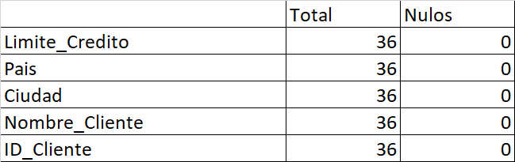
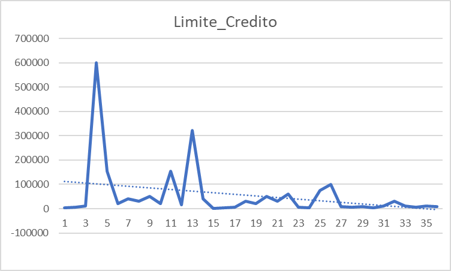
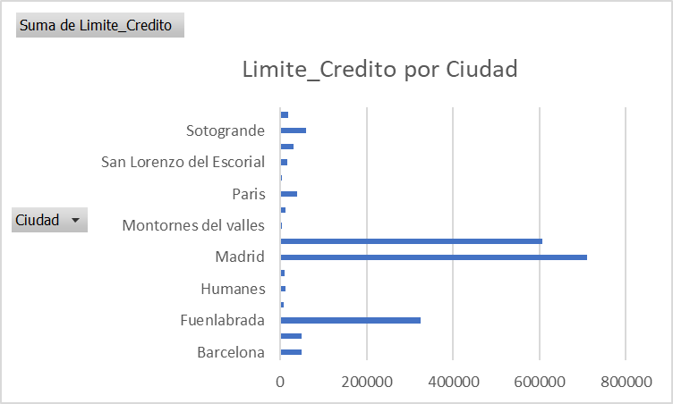
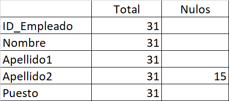
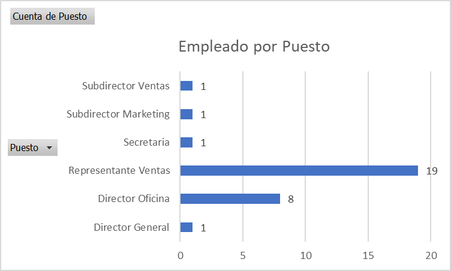
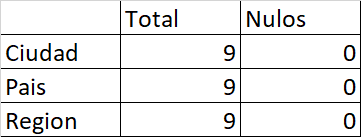
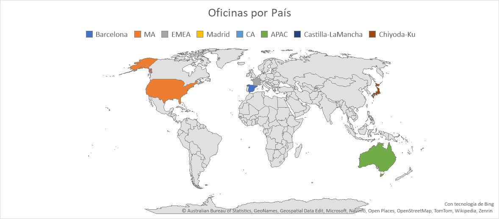
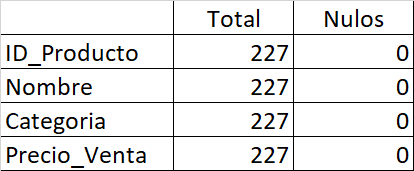
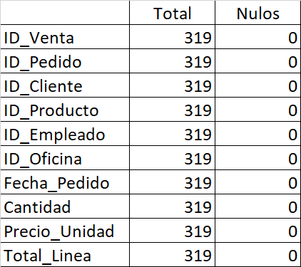

[Atrás](../readme.md)

# F20 - Evidencia de aprendizaje 4. Proyecto integrador-Repositorio de todas las actividades

1. __Realiza pruebas que te permitan determinar la calidad de los datos.__ ✅

Para los test de calidad de datos he optado por utilizar knime, con el fin de evaluar los nulos, valores atípicos y valores faltantes.

## Cliente

> Verificación de nulos:

> Limite de credito:

> Limite de credito por ciudad

## Empleado

> Verificación de nulos:

> Empleados por puesto:

## Oficina

> Verificación de nulos:

> Oficinas por país:

## Producto

> Verificación de nulos:

## fact_Ventas

> Verificación de nulos:

2. __Organiza las actividades__ ✅
    - Reúne todos los archivos y documentos relacionados con cada una de las actividades desarrolladas, incluyendo los informes, consultas SQL, scripts, diagramas y, ahora, también las pruebas de verificación de calidad de datos.

3. __Crea una estructura de carpetas__ ✅
    - Diseña una estructura de carpetas clara y organizada para almacenar todos los archivos en el repositorio de Git. Asegúrate de incluir una carpeta específica para las pruebas de calidad de datos.

4. __Agrega archivos al repositorio__ ✅

5. __Confirma los cambios__ ✅