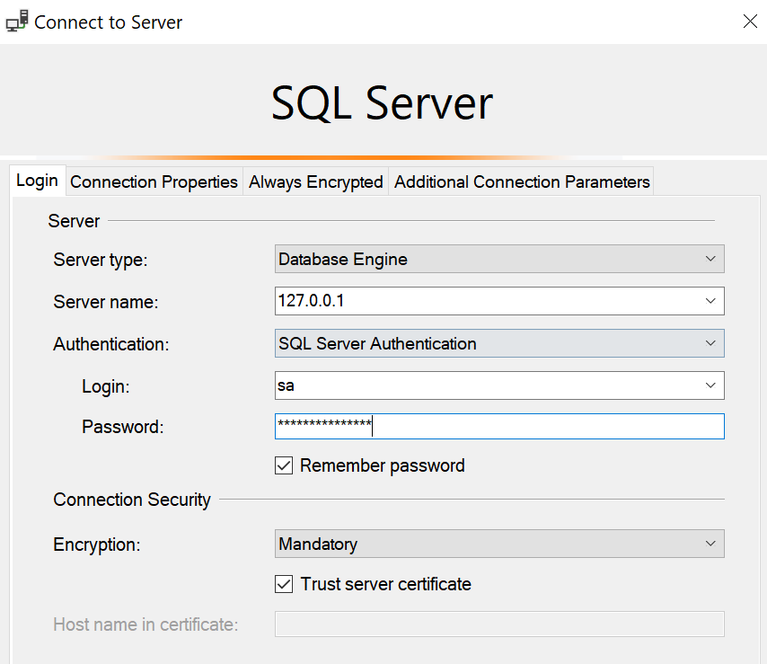

# Introducción

Este repositorio alberga la información del módulo **BD Bases de Datos II** correspondiente a la ficha **PREICA2402B010070**. El proyecto principal consiste en el diseño de un modelo estrella para un data mart, basado en la base de datos Jardinería. 

El modelo está diseñado para analizar y responder a tres categorías específicas:

1. Identificar el producto más vendido
2. Determinar la categoría con mayor número de productos
3. Establecer el año con el volumen de ventas más alto

La estructura del proyecto incluye una base de datos de staging para el procesamiento inicial de los datos, seguida de su normalización en un data mart. Este enfoque permite una gestión eficiente de la información y facilita el análisis detallado de los datos de ventas y productos de la empresa Jardinería.

**Temario:**

I. [Modelo estrella de un data mart](I/readme.md)

II. [Creación de una BD de staging](II/readme.md)

III. [Proceso de transformación y carga en el data mart final](III/readme.md)

IV. [Proyecto Integrador - Repositorio de todas las actividades](IV/readme.md)


## Implementación Técnica
La base de datos ha sido implementada utilizando tecnología de contenedores:

__Docker:__ La base de datos está montada en un contenedor Docker, lo que garantiza la portabilidad y la consistencia del entorno.

__Docker Compose:__ Se utiliza para orquestar y configurar fácilmente el contenedor de la base de datos, permitiendo un despliegue rápido y reproducible del proyecto.

 ```bash
 # configurar BD
docker-compose up -d
```


## Conexión
__Contraseña:__ Test01.*qw




